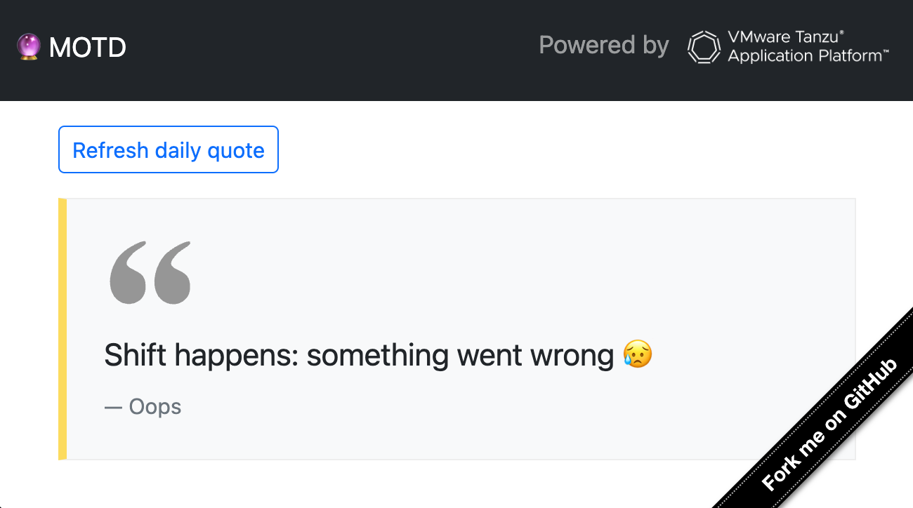

# Message of the Day :: Frontend

> [!NOTE]
> This is the frontend component of the
> [Message of the Day](https://github.com/alexandreroman/motd) app

This component is responsible for providing a Web UI:



## Running this component on your workstation

Use these commands to run this component on your workstation:

```shell
export MOTD_SERVICES_BACKEND=http://localhost:8081
npm i; npm start
```

Then hit http://127.0.0.1:8080 with your browser.

## Deploying with VMware Tanzu Application Platform

Use this command to deploy this component to your favorite Kubernetes cluster:

```shell
tanzu apps workload apply -f config/workload.yaml
```

The platform will take care of building, testing and deploying this component.

This component also loads some configuration from a
[Git repository](https://github.com/alexandreroman/motd-config).

Run this command to create a Kubernetes `Secret` out of this Git repository,
which will be used by the component at runtime:

```shell
kubectl apply -f config/app-operator
```

Run this command to get deployment status:

```shell
tanzu apps workload get motd-frontend
```
